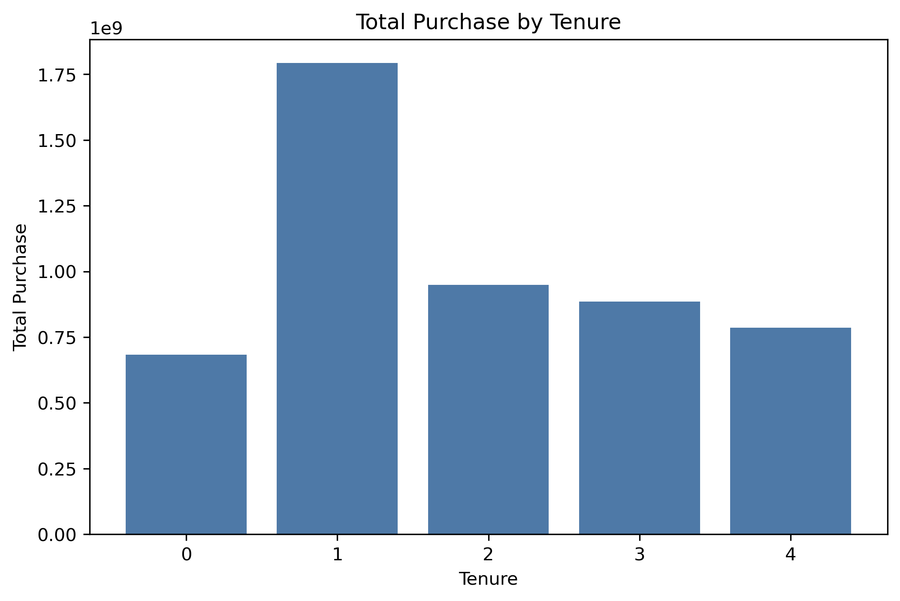

# Black Friday Sales Analysis

<p align="center"><strong>A reproducible retail analytics project that combines Python, SQL, statistical testing, and Power BI.</strong></p>

<p align="center">
  
  
  
  
  
  
  
  <a href="#practical-limits"></a>
</p>

---

## Overview

This project analyzes Black Friday transaction data to understand how customer demographics, location, and tenure relate to purchase behavior. It includes a Python processing pipeline, a MySQL setup script, a notebook for statistical analysis, and a Power BI report with screenshots.

The notebook focuses on exploratory analysis, feature engineering, and hypothesis testing. It does not train a predictive model.

## What Is In The Repo

- [notebooks/black_friday_sales_analysis.ipynb](notebooks/black_friday_sales_analysis.ipynb) for the analysis workflow, feature engineering, and statistical testing.
- [src/pipeline.py](src/pipeline.py) and [src/data_processing.py](src/data_processing.py) for cleaning and feature engineering.
- [sql/mysql_schema.sql](sql/mysql_schema.sql) for the MySQL database setup and CSV load step.
- [reports/dashboard.pbix](reports/dashboard.pbix) for the Power BI report.
- [reports/figures/](reports/figures) for the dashboard screenshots used in the README.

## Workflow

1. Read the raw CSV from `data/raw/black_friday_sales_raw.csv`.
2. Clean and standardize the transaction data in Python.
3. Engineer customer and product features.
4. Export the processed dataset to `data/processed/black_friday_sales_master.csv`.
5. Use SQL for a lightweight MySQL setup when a database-backed workflow is needed.
6. Run statistical analysis in the notebook.
7. Review the results in Power BI.

## Architecture

The project keeps the processing layers separate so the notebook stays focused on analysis.

```text
Raw CSV
  -> Python cleaning and feature engineering
  -> Processed master dataset
  -> MySQL schema and load script
  -> Notebook analysis and statistical testing
  -> Power BI report and screenshots
```

## Methodology

| Stage | Tools | What it does |
|-------|-------|--------------|
| SQL setup | MySQL | Creates the database and raw table, then loads the CSV for database-backed analysis. |
| Cleaning | Python, pandas, NumPy | Standardizes column names, handles missing values, and prepares transaction data. |
| Feature engineering | Python, pandas | Builds metrics such as Customer Lifetime Value, Category Breadth, City Loyalty Index, and Product Popularity Score. |
| Statistical testing | SciPy | Runs Welch's t-tests and one-way ANOVA to compare spend across groups. |
| Visualization | matplotlib, seaborn, Power BI | Produces notebook charts and the final dashboard. |

## Notebook Focus

The notebook covers:

- Problem statement and data dictionary.
- Derived metrics such as CLV, Category Breadth, City Loyalty Index, and Product Popularity Score.
- Exploratory charts for spending patterns.
- Welch's t-tests for gender and marital status.
- One-way ANOVA for age, city category, and tenure.
- A short business summary at the end.

## Key Findings

The analysis supports a few clear points.

- Gender is associated with a meaningful difference in average spend.
- Marital status is not a strong driver of spend in this dataset.
- Age group and city category both show statistically significant differences in spending.
- Tenure shows statistical significance, but the practical impact appears weak.
- The notebook's main customer profile is a male buyer aged 26 to 35, with early-stage residents also standing out in the analysis.

These findings are useful for segmentation, but they should be treated as descriptive insights, not as a prediction model.

## Dashboard Preview

<p align="center">
  
</p>

<p align="center">
  
</p>

<p align="center">
  
</p>

## Quick Start

```bash
git clone https://github.com/Dipjyoti-Karmakar/black-friday-sales-analysis.git
cd black-friday-sales-analysis

python -m venv .venv
.venv\Scripts\activate

pip install -r requirements.txt

python -m src.pipeline
jupyter notebook notebooks/black_friday_sales_analysis.ipynb
```

Place the raw file at `data/raw/black_friday_sales_raw.csv` before running the pipeline.

## Practical Limits

- The SQL layer is a setup and load script, not a full production ETL system.
- The Power BI report is stored as a local `.pbix` file, so Power BI Desktop is required to edit it.
- The repository does not include a trained forecasting model or deployed app.
- The raw CSV is not committed here, so the pipeline depends on you adding it locally.

## Small Improvements That Would Help

- Add a short data quality checklist for the raw CSV.
- Add a saved sample output from the pipeline for faster validation.
- Add a simple CI check that runs the existing tests.
- Add a brief note in the notebook about which figures are meant for the final dashboard.

## Tech Stack

Python, pandas, NumPy, SciPy, matplotlib, seaborn, MySQL, PyMySQL, SQLAlchemy, Jupyter, Power BI

## Author

**Dipjyoti Karmakar**  
Data Analyst | Analytics and Business Intelligence  
[LinkedIn Profile](https://www.linkedin.com/in/dipjyoti-karmakar-dk/)  
[dipjyotikarmakar97@gmail.com](mailto:dipjyotikarmakar97@gmail.com)
