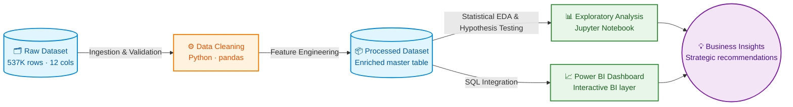
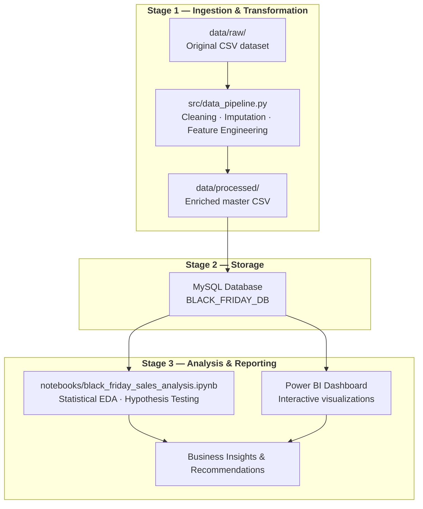

<h1 align="center">Black Friday Sales Analysis</h1>

<p align="center">
  <strong>End-to-end data engineering &amp; analytics pipeline — from raw retail transactions to actionable business intelligence.</strong>
</p>

<p align="center">
  
  
  
  
  
</p>

---

## Overview

This project analyzes **537K+ Black Friday retail transactions** to uncover customer purchase behavior across demographics, product categories, and geographic segments. The pipeline ingests raw CSV data, performs cleaning and feature engineering in Python, loads the enriched dataset into MySQL, conducts statistical EDA in Jupyter, and delivers a Power BI dashboard for stakeholder consumption.

### Key Outcomes
- Identified the **"Power Consumer" profile**: Male, aged 26–35, City B, 1–2 year resident.
- Proved via **hypothesis testing** (T-Test / ANOVA) that Gender and City significantly drive spending, while Marital Status does not.
- Engineered **4 custom features** — CLV, Category Breadth, City Loyalty Index, Product Popularity Score — enabling customer segmentation beyond raw demographics.
- Delivered a **Power BI dashboard** surfacing revenue breakdowns, top products, and demographic overlays for business stakeholders.

---

## Architecture & Pipeline

### High-Level Architecture



### Data Pipeline Flow



---

## Dashboard & Visualizations

### Interactive Dashboard Demo

<p align="center">
  
</p>

### Final Dashboard Snapshot

<p align="center">
  
</p>

### Marketing Dashboard (Page 2)

<p align="center">
  
</p>

> *Place your Power BI screenshots in `reports/figures/powerbi_dashboard_executive.png` (Executive) and `reports/figures/powerbi_dashboard_marketing.png` (Marketing). Add an animated GIF walkthrough in `reports/demo.gif`.*

---

## Project Structure

```text
black-friday-sales-analysis/
│
├── data/
│   ├── raw/                        # Immutable source data (original CSV)
│   └── processed/                  # Cleaned, feature-enriched master dataset
│
├── notebooks/
│   └── black_friday_sales_analysis.ipynb  # Full EDA: profiling, visualization, hypothesis testing
│
├── src/
│   ├── data_pipeline.py            # Automated cleaning & feature engineering script
│   └── mysql_black_friday_setup.sql # MySQL schema, CSV import, validation views
│
├── reports/
│   ├── figures/
│   │   ├── powerbi_dashboard_executive.png # Power BI — Executive dashboard snapshot (Page 1)
│   │   └── powerbi_dashboard_marketing.png # Power BI — Marketing dashboard snapshot (Page 2)
│   └── demo.gif                    # Animated dashboard walkthrough
│
├── Dataset/                        # Original dataset folder (legacy — preserved for Git history)
├── Pipeline/                       # Original pipeline folder (legacy — preserved for Git history)
│
├── README.md
├── requirements.txt                # Pinned Python dependencies
└── .gitignore
```

---

## Quick Start

```bash
# 1. Clone the repository
git clone https://github.com/<your-username>/black-friday-sales-analysis.git
cd black-friday-sales-analysis

# 2. Create a virtual environment & install dependencies
python -m venv .venv
.venv\Scripts\activate          # Windows
pip install -r requirements.txt

# 3. Run the data pipeline (produces data/processed/black_friday_sales_master.csv)
python src/data_pipeline.py

# 4. (Optional) Set up MySQL database
#    Open src/mysql_black_friday_setup.sql in MySQL Workbench
#    and execute — adjust the LOAD DATA path to your local machine.

# 5. Launch the analysis notebook
jupyter notebook notebooks/black_friday_sales_analysis.ipynb
```

---

## Methodology

| Phase | Tools | Description |
|:------|:------|:------------|
| **Ingestion** | Python, pandas | Read 537K-row CSV; validate schema and types |
| **Cleaning** | pandas, NumPy | Impute nulls in `Product_Category_2/3` with 0; coerce `Stay_In_Current_City_Years` (`4+` → `4`) |
| **Feature Engineering** | pandas | Derive CLV, Category Breadth, City Loyalty Index, Product Popularity Score |
| **Database** | MySQL, SQLAlchemy | Load enriched data; create reporting views (Customer, Product, Transaction) |
| **EDA** | matplotlib, seaborn, SciPy | Histograms, boxplots, heatmaps; T-Tests (Gender, Marital Status), ANOVA (Age, City, Tenure) |
| **Dashboarding** | Power BI | Interactive drill-down dashboard connected to MySQL |

---

## Key Business Insights

| Hypothesis | Test | P-Value | Verdict |
|:-----------|:-----|:--------|:--------|
| Men spend more than Women | Welch's T-Test | < 0.05 | ✅ **Significant** — Males spend ~$703 more per transaction |
| Married ≠ Single spending | Welch's T-Test | 0.73 | ❌ Not significant — $4.73 difference is noise |
| Spending varies by Age Group | One-Way ANOVA | < 0.05 | ✅ **Significant** — 26–35 age group dominates revenue |
| Spending varies by City | One-Way ANOVA | < 0.05 | ✅ **Significant** — City B drives highest volume |
| Tenure affects spending | One-Way ANOVA | < 0.05 | ⚠️ Statistically significant but **practically weak** |

### Strategic Recommendations
1. **Acquire 1-year residents aggressively** — they drive the highest transaction volume and total revenue.
2. **Upsell 2-year residents** — they have the highest average order value; target with premium product campaigns.
3. **Investigate the tenure drop-off** — spending declines sharply at 4+ years; deploy re-engagement strategies.
4. **Deprioritize marital-status segmentation** — no measurable impact on purchasing behavior.

---

## Tech Stack

<p>
  
  
  
  
  
  
  
  
  
</p>

---

## Contributing

1. Fork the repository.
2. Create a descriptive branch: `feature/<short-description>`.
3. Open a pull request with a clear summary and any data/visual artifacts.

---

## Contact

**Dipjyoti Karmakar** — [LinkedIn](https://www.linkedin.com/in/dipjyoti-karmakar-dk/)

---
