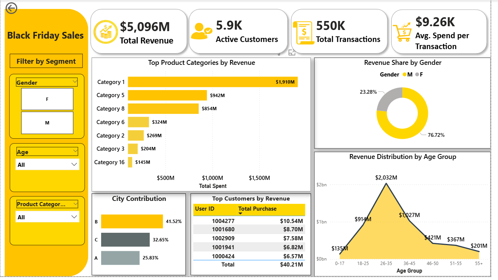
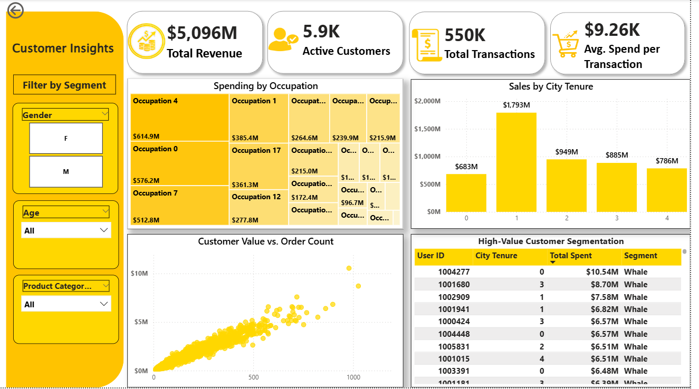

# Black Friday Sales Analysis

<p align="center"><strong>Data processing and analytics workflow — from raw retail transactions to actionable business insights.</strong></p>

<p align="center">
  
  
  
  
  
</p>

---

## Executive Summary

This analysis examines **550,068 Black Friday transactions (~$5B+ revenue)** to determine which demographic and geographic factors meaningfully drive purchasing behavior.

Using statistical validation and feature engineering, the project identifies high-value customer segments and translates findings into practical business recommendations.

## Overview

The workflow:
1. Ingest raw CSV data  
2. Clean and standardize transactional records  
3. Engineer analytical features  
4. Validate hypotheses using statistical testing  
5. Deliver executive-ready dashboards in Power BI

### Key Outcomes

- Identified the **"Power Consumer"** profile: Male, 26–35 years, City B, 1–2 year resident  
- Statistically validated spending drivers using Welch’s T-Test and ANOVA  
- Engineered advanced features including **Customer Lifetime Value (CLV)** and **Category Breadth**  
- Built a multi-page Power BI dashboard for executive and marketing stakeholders  

---

## Architecture

The pipeline is designed for reproducibility and clarity, separating raw data, transformation logic, and reporting layers.

**Data Flow**

```
Raw CSV (data/raw)
        ↓
Processing & Feature Engineering (src/)
        ↓
Processed Master Dataset (data/processed)
        ↓
Statistical Analysis (Jupyter)
        ↓
Interactive Dashboard (Power BI)
```

---

## Project Structure

```
black-friday-sales-analysis/
│
├── data/
│   ├── raw/                        # Original dataset
│   ├── interim/                    # Temporary outputs
│   └── processed/                  # Cleaned master dataset
│
├── notebooks/
│   └── black_friday_sales_analysis.ipynb
│
├── reports/
│   ├── figures/                    # Dashboard screenshots
│   └── dashboard.pbix              # Power BI file
│
├── sql/
│   └── mysql_schema.sql            # Database schema
│
├── src/
│   ├── __init__.py
│   ├── data_processing.py          # Cleaning & feature engineering
│   └── pipeline.py                 # Pipeline orchestration
│
├── tests/
│   └── test_pipeline.py
│
├── README.md
├── requirements.txt
└── .gitignore
```

---

## Methodology

| Phase | Tools | Purpose |
|-------|-------|----------|
| Ingestion | Python, pandas | Load and validate raw dataset |
| Cleaning | pandas, NumPy | Handle nulls and normalize categorical fields |
| Feature Engineering | pandas | CLV, Category Breadth, Loyalty metrics |
| Statistical Testing | SciPy | Welch’s T-Test, One-Way ANOVA |
| Visualization | Power BI | Interactive executive & marketing dashboards |

---

## Dashboard Preview

<p align="center">
  
</p>

<p align="center">
  
</p>

---

## Key Business Insights

Demographic and geographic segmentation significantly influence revenue, while some commonly assumed factors show minimal practical impact.

- **Gender impacts spending** — males spend more on average  
- **City category drives revenue** — City B leads in total sales  
- **Marital status has no significant effect**  
- **Age group 26–35 dominates revenue contribution**  
- Tenure shows statistical significance but weak business impact  

---

## Quick Start

```bash
git clone https://github.com/Dipjyoti-Karmakar/black-friday-sales-analysis.git
cd black-friday-sales-analysis

python -m venv .venv
.venv\Scripts\activate   # Windows

pip install -r requirements.txt

python -m src.pipeline

jupyter notebook notebooks/black_friday_sales_analysis.ipynb
```

> Ensure `black_friday_sales_raw.csv` is placed inside `data/raw/` before running the pipeline.

---

## Reproducibility

The project is structured so the processed dataset can be regenerated at any time using:

```bash
python -m src.pipeline
```

All transformation logic is isolated inside the `src/` directory, ensuring separation between analysis notebooks and production logic.

---

## Tech Stack

Python • pandas • NumPy • SciPy • MySQL • Jupyter • Power BI

---

## Author

**Dipjyoti Karmakar**  
Data Analyst | Analytics & Business Intelligence  
[LinkedIn Profile](https://www.linkedin.com/in/dipjyoti-karmakar-dk/)
